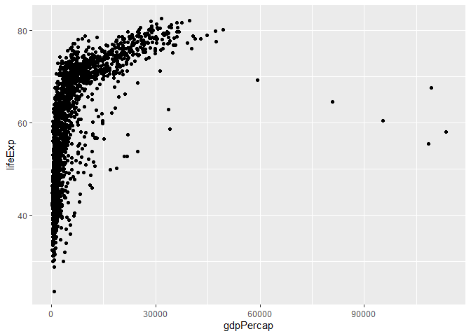

# Introduction

Here is my first rmd document - this is where you'd be writing the text of your analysis or manuscript.

# Lets embed some r code

We'll write an R chunk that loads the tidyverse packaged and then reads in the Gapminder data set from the data subdirectory of the project.

Use ctrl+alt+i on a PC as quick key to insert new R chunk.


# Investigate gm data

Let's take a look at the gm


```r
head(gm)
```

```
## # A tibble: 6 x 6
##   country     continent  year lifeExp      pop gdpPercap
##   <chr>       <chr>     <dbl>   <dbl>    <dbl>     <dbl>
## 1 Afghanistan Asia       1952    28.8  8425333      779.
## 2 Afghanistan Asia       1957    30.3  9240934      821.
## 3 Afghanistan Asia       1962    32.0 10267083      853.
## 4 Afghanistan Asia       1967    34.0 11537966      836.
## 5 Afghanistan Asia       1972    36.1 13079460      740.
## 6 Afghanistan Asia       1977    38.4 14880372      786.
```

# Our first plot

showing gdp per capita on x and life expectancy on y


```r
ggplot(gm, aes(x = gdpPercap, y = lifeExp)) +
  geom_point()
```



Good practice to run all your code before you knit the code, so you can find any errors, otherwise it will fail (knit with ctrl+shift+k?)

# A better plot


```r
ggplot(gm, aes(x = gdpPercap, y = lifeExp)) +
  geom_point(aes(col = continent)) +
  scale_x_log10()
```


# Possible chunk options

Options include:
- echo (TRUE by default) whether to include the code in the output
- results 
  - hide will hide the results (not usually helpful).
  - hold will hold results until the end of the R chunk (helpful if you want all of the code, and then all of the output).
- include (TRUE by default) if FALSE then code will be shown, but not run (say you had a view() in your code, and you just wanted to show someone that's what they should do, but not actually run within your document)
- fig.width, fig.height set the figure dimensions in your output
-cache (FALSE by default) if you want to reknit the document several times while you change colors etc, you can cahce the results of an R chunk - it will evaluate when you knit if that chunk has changed, and if it hasn't it will just pull up the saved result so it won't take a half-hour.

# Table in RMarkdown

See some data using head


```r
head(gm)
```

```
## # A tibble: 6 x 6
##   country     continent  year lifeExp      pop gdpPercap
##   <chr>       <chr>     <dbl>   <dbl>    <dbl>     <dbl>
## 1 Afghanistan Asia       1952    28.8  8425333      779.
## 2 Afghanistan Asia       1957    30.3  9240934      821.
## 3 Afghanistan Asia       1962    32.0 10267083      853.
## 4 Afghanistan Asia       1967    34.0 11537966      836.
## 5 Afghanistan Asia       1972    36.1 13079460      740.
## 6 Afghanistan Asia       1977    38.4 14880372      786.
```

now we're going to turn that exat output as a nicely formatted table


```r
library(knitr)
kable(head(gm))
```


country       continent    year   lifeExp        pop   gdpPercap
------------  ----------  -----  --------  ---------  ----------
Afghanistan   Asia         1952    28.801    8425333    779.4453
Afghanistan   Asia         1957    30.332    9240934    820.8530
Afghanistan   Asia         1962    31.997   10267083    853.1007
Afghanistan   Asia         1967    34.020   11537966    836.1971
Afghanistan   Asia         1972    36.088   13079460    739.9811
Afghanistan   Asia         1977    38.438   14880372    786.1134

If you loke tables, look at **gt** table package - ** here makes bold, * makes italicized.

